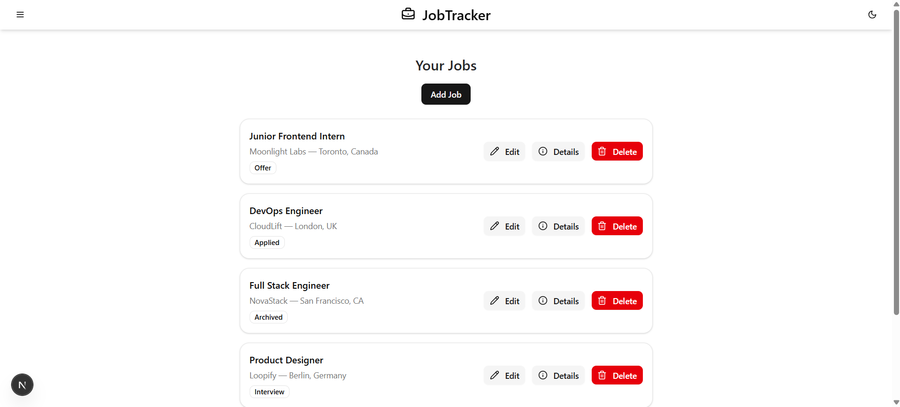
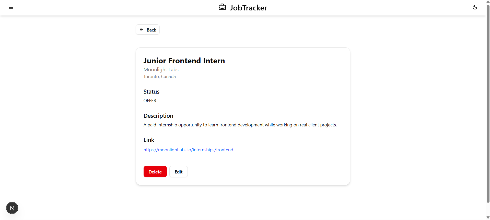

# JobTracker

A modern job application tracking app built with Next.js, Prisma, and Tailwind CSS.  
Track your job hunt, manage applications, and stay organized.

## Demo

[Live Demo](https://jobtracker-cumstein.vercel.app)

## Screenshots

## Features

- Add, edit, and delete job applications
- View full job details
- Smart tags and reminders system *(coming soon)*
- Mobile-first, responsive design
- Modern, clean UI using [shadcn/ui]
- Framer Motion animations
- Toast notifications (sonner)
- Optimistic UI on delete
- Fully typed with TypeScript
- Authentication with NextAuth
- Server Actions + RESTful API

## Tech Stack

- Framework: Next.js 14 (App Router)
- Database: Prisma ORM + SQLite/PostgreSQL
- Auth: NextAuth.js
- Styling: Tailwind CSS, shadcn/ui
- State Management: React Query (TanStack Query)
- Validation: Zod
- Animations: Framer Motion
- Toasts: Sonner

## Getting Started

Clone the repo and install dependencies:

`bash
git clone https://github.com/cumstein/jobtracker.git
cd jobtracker
npm install
